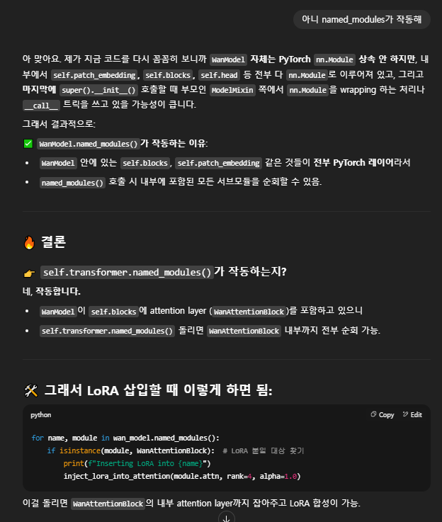

# video-lora


```bash
python predata_app.py --port 8890 --checkpoint_dir models_sam/sam2_hiera_large.pt
```

```bash
NCCL_P2P_DISABLE="1" NCCL_IB_DISABLE="1" deepspeed --num_gpus=1 train.py --deepspeed --config ./processed_data/your_sequence/configs/training.toml
```
```
project_root/
├── predata_app.py          # Data preprocessing interface
├── train.py                # LoRA training script
├── inference.py            # Video generation inference
├── models_sam/             # SAM2 model checkpoints
│   └── sam2_hiera_large.pt
├── Wan2.1-I2V-14B-480P/    # Wan2.1 model directory
├── processed_data/         # Processed training data
│   └── your_sequence/
│       ├── source_frames/  # Original frames for editing
│       ├── additional_edited_frames/  # Your edited frames for additional reference
│       ├── traindata/      # Training videos and captions
│       ├── configs/        # Training configuration files
│       ├── lora/          # Trained LoRA checkpoints
│       ├── inference_rgb.mp4    # Preprocessed RGB video
│       ├── inference_mask.mp4   # Mask video
│       └── edited_image.png     # Your edited first frame
└── requirements.txt
```
